

<h1>Sketch-a-Sketch</h1>

<b>Controlling Diffusion Based Image Generation With Just A Few Strokes</b>

**[Code](https://github.com/syntaxticsugr/Sketch-a-Sketch) | [Colab Demo](https://colab.research.google.com/drive/1nixppTxf0xkGlZMFdmG1NMbZRrAWuQJz?usp=sharing) | [Credits](https://github.com/vsanimator/sketch-a-sketch)**

 
 

It’s really fun playing with generative AI tools, but its incredibly hard to engineer text prompts that produce the specific images you want. You’ve probably seen sketch-to-image tools that aim to make it "easier" to control generative AI, but to get a good image, you typically need to control the AI with a fairly complete sketch. Since most of us are not great at drawing, that’s prevented most of us from using sketch to image.

***Sketch-a-Sketch* makes it much easier to control the output of generative AI from sketches, because it works using simple sketches that only have a few strokes -- sketches that most of us can draw.**

**Prompt: "A medieval castle, realistic"**

| **Input Sketch** | **Generated Image** | **Suggested Lines**
|:--:| :--: | :--: |
| 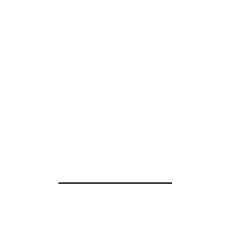 | 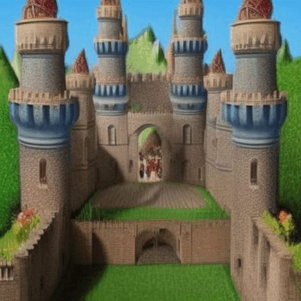 | 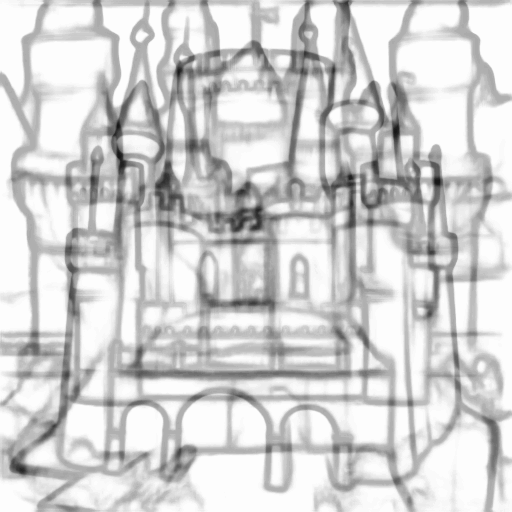 |

To give you an idea of how it works, think about the game of Pictionary, where your teammates must guess the object you are trying to draw as quickly as possible. If you’re good at the game, your teammates will guess what you’re trying to depict after just a few strokes (a partial sketch). If your team can’t guess what you’re trying to draw, you just keep sketching to add detail in order to make the concept more clear.

With *Sketch-a-Sketch*, controlling generative AI is lot like playing Pictionary: just sketch a few strokes, and the AI will guess what you are trying to draw and give you suggestions for high-quality final images.
If the AI isn’t giving you the images you want, don’t worry. Just draw a few more strokes to make your desired image more clear, and keep iterating until the AI creates the images you hoped for.

Even better, *Sketch-a-Sketch* will help you create "winning" sketches. As you sketch, the *Sketch-a-Sketch* system will show you suggestions for future lines that will be most helpful in helping the AI guess what final image you want.

Here are a few examples, displaying 1) the user-drawn input sketch, 2) a *Sketch-a-Sketch*-generated image, and 3) suggested lines:

**Prompt: "A ceramic mug"**

| **Input Sketch** | **Generated Image** | **Suggested Lines**
|:--:| :--: | :--: |
| 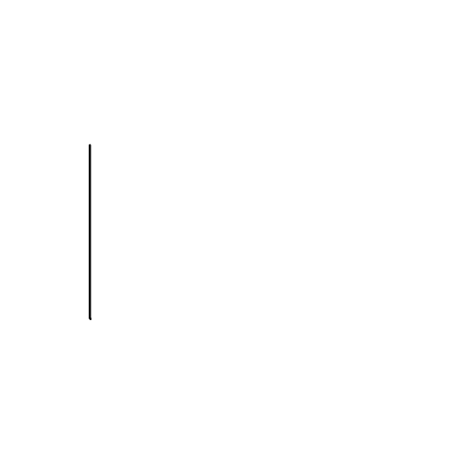 | 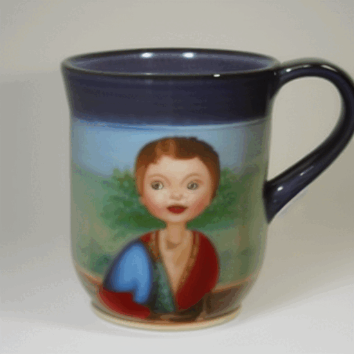 | 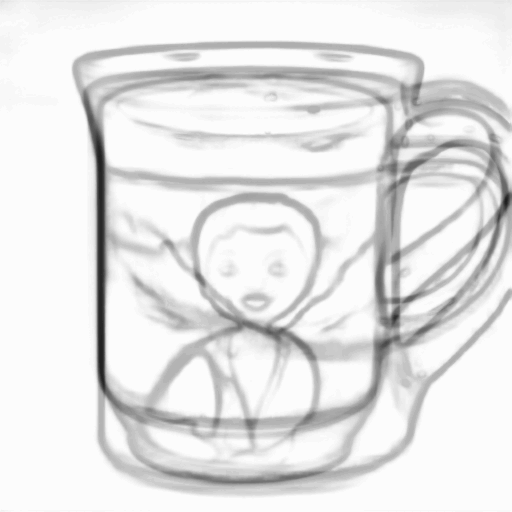 |

**Prompt: "A hobbit house with a mailbox"**

| **Input Sketch** | **Generated Image** | **Suggested Lines**
|:--:| :--: | :--: |
| 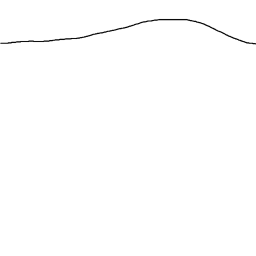 | 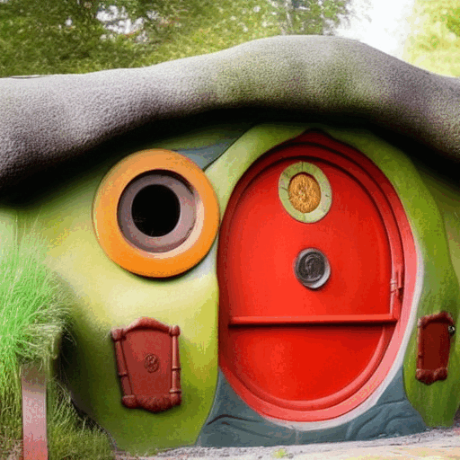 | 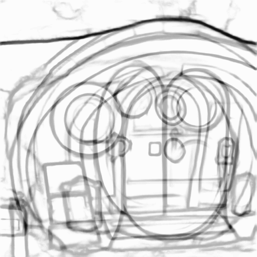 |

**Prompt: "A lighthouse at the edge of the ocean"**

| **Input Sketch** | **Generated Image** | **Suggested Lines**
|:--:| :--: | :--: |
| 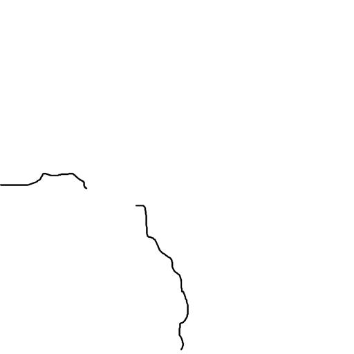 | 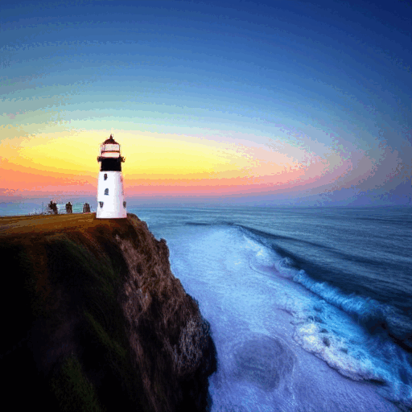 | 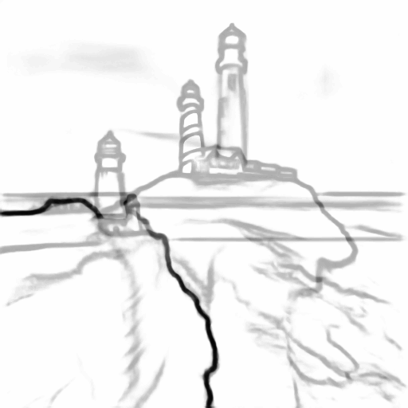 |

**Prompt: "A row of brown shoes"**

| **Input Sketch** | **Generated Image** | **Suggested Lines**
|:--:| :--: | :--: |
| 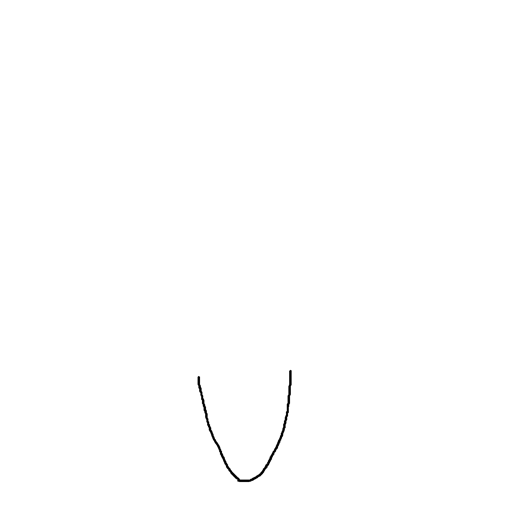 | 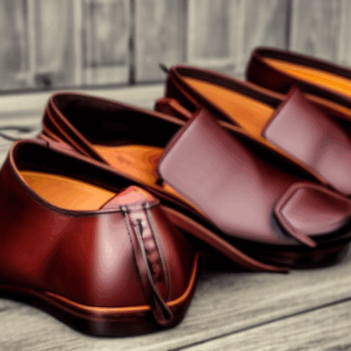 | 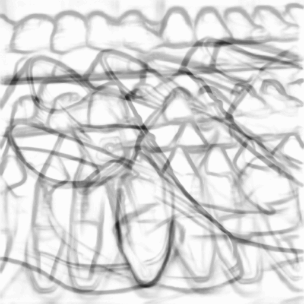 |

# How it works

Existing methods for sketch-controlled image generation include [ControlNet](https://github.com/lllyasviel/ControlNet), [Sketch-Guided Diffusion](https://sketch-guided-diffusion.github.io), and [DiffSketching](https://arxiv.org/abs/2305.18812). While existing sketch-to-image methods show promising results, they have one key flaw: they are trained to work on completed sketches. However, **a typical sketching workflow is an iterative work-in-progress!** Artists progressively add or remove lines, sometimes constructing basic structures before diving into finer details, at other times focusing on one region of an image before moving on to another. Therefore, **we need sketch-to-image functionality at intermediate stages of the sketching process**.

In *Sketch-a-Sketch*, we introduce a ControlNet model that generates images conditioned on *partial sketches*. With this ControlNet, *Sketch-a-Sketch* 1) generates images corresponding to a sketch at various stages of the sketching process, and 2) leverages these images to generate suggested lines that can help guide the artistic process.

## Problem: Existing methods don't work with partial sketches

Prior work is trained on paired datasets of images and completed sketches. When attempting to generate an image from a partial sketch, these methods treat the sketch as completed, so the whitespace in the rest of the sketch is treated as an indicator that the image should not have content that would typically correspond to a stroke in the input sketch.

For instance, given the first few lines of a house, ControlNet fails to generate significant detail outside the region where the lines are drawn:

**Prompt: "a photorealistic house"**

| **Input Sketch** | **Generated Image 1** | **Generated Image 2** |
| :--: | :--: | :--: |
| 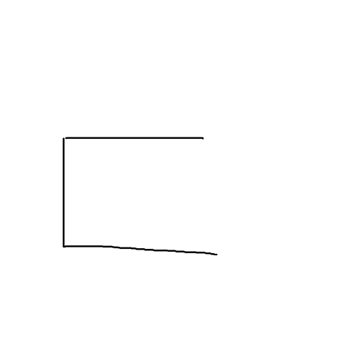 | 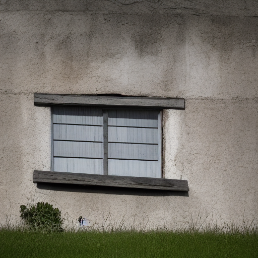 | 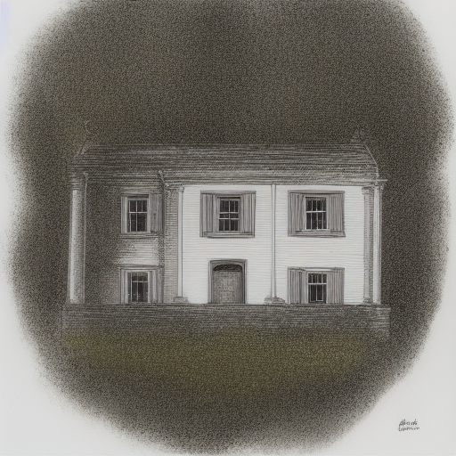 |

On the other hand, *Sketch-a-Sketch* generates the following images from the first few lines of a house:

**Prompt: "a photorealistic house"**

| **Input Sketch** | **Generated Image 1** | **Generated Image 2** |
| :--: | :--: | :--: |
| 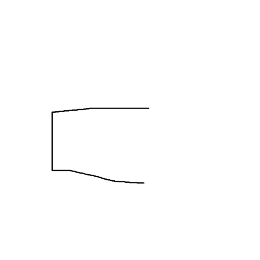 | 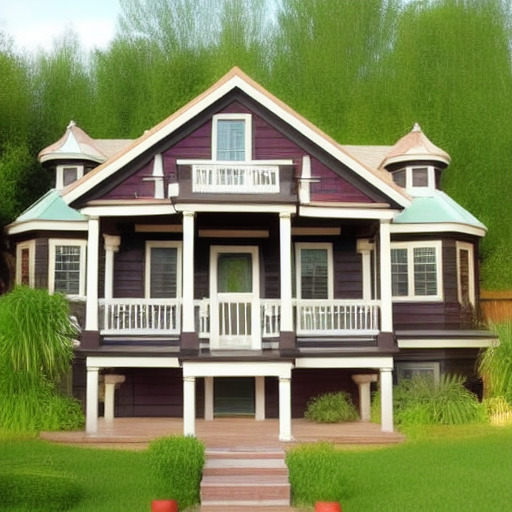 | 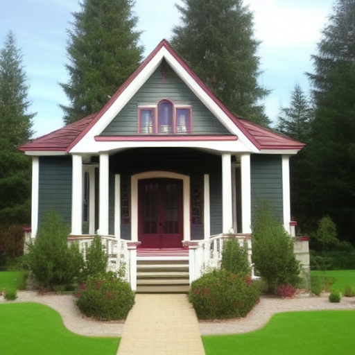 |

In these sketches, features corresponding to the lines are present in the generated images: a pillar supporting the roof, the top of a railing, the bottom of a porch, etc. However, there are plenty of major image features present in regions where the sketch contains only whitespace.

## Make training data: Make partial sketches by randomly deleting lines

[Photo-Sketch](https://mtli.github.io/sketch/) is the largest existing dataset of text-captioned images paired with sketches at partial stages of completion. However, this dataset is 1) restricted to sketches of only 1000 images (we would like a larger dataset), 2) the images are all of outdoor scenes (lacking diversity for general text-conditioned generation), and 3) are constructed by tracing over an existing image (imposing a ordering of strokes that may not correspond to the sketching process of many artists).

Therefore, we programmatically construct our own dataset of captioned images paired with partial sketches. We accomplish this by 1) converting an image to a rasterized edge map with [HED](https://arxiv.org/abs/1504.06375), 2) [vectorizing](https://github.com/MarkMoHR/virtual_sketching) the edge map into a collection of strokes, and 3) *randomly deleting a fraction of the strokes*. By deleting strokes in arbitrary order, we enable image generation conditional on strokes drawn in any order as well, accomodating various styles of sketching.

| **Input Image** | **HED Image** | **Partial Sketch**
|:--:| :--: | :--: |
| 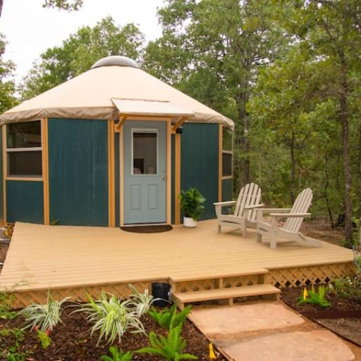 | 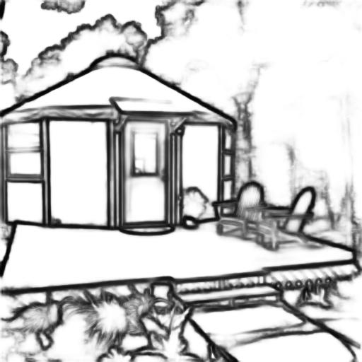 | 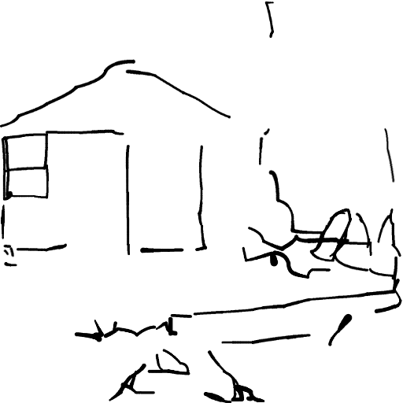 |
| 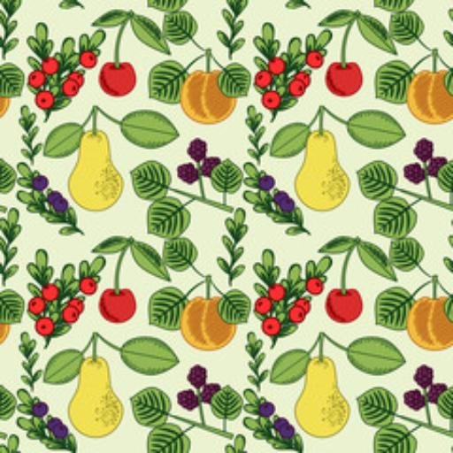 | 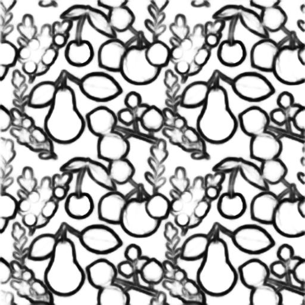 | 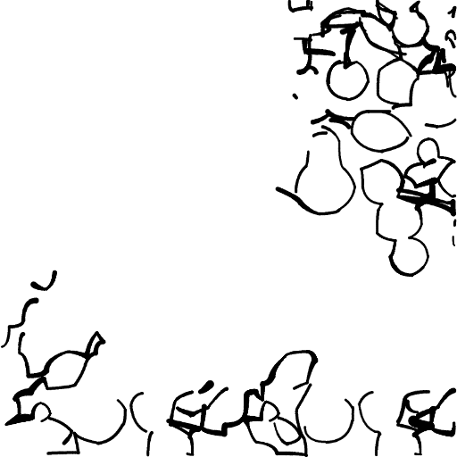 |
| 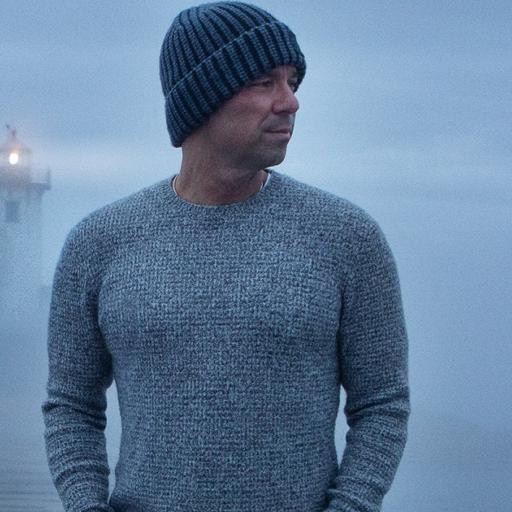 | 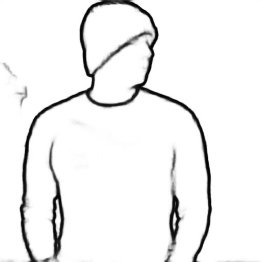 | 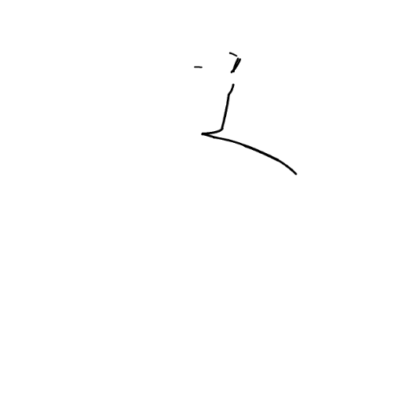 |

We construct our paired dataset using 45000 images from [LAION Art](https://huggingface.co/datasets/laion/laion-art), and we train a [ControlNet](https://github.com/lllyasviel/ControlNet) model to condition [Stable Diffusion 1.5](https://huggingface.co/runwayml/stable-diffusion-v1-5) on the image-sketch pairs. The trained model takes a text caption and a partial sketch as inputs, and outputs generated images corresponding to a potential completion of the sketch. Note that by training on many different random partial sketches, of varying levels of completeness, the model learns to take a sketch of **any** level of completeness to a final image. That means that there are no assumptions about the order that people draw lines into the model. Users can draw lines in any order the wish, and *Sketch-to-Sketch* will still generate an image from the current state of the sketch.

## Generating possible images

When an artist isn't quite sure how they'd like to draw a part of an image, we can generate a variety of visual completions given the lines drawn so far. Here, the artist isn't quite sure how they'd like to draw the handle of the mug, so we generate three images that are all valid completions of the initial sketch, showing varying handles paired with the same outline of the body:

## Providing suggested lines to help me draw

With these generated images, *Sketch-a-Sketch* can provide suggestions on potential lines to draw. We generate potential completions of the existing drawing by running HED on the generated images, then averaging these 'completed sketches' to get an image of suggested lines:

The suggested lines feature echoes prior drawing help tools like [ShadowDraw](https://vision.cs.utexas.edu/projects/shadowdraw/shadowdraw.html), or image collection exploration tools like [AverageExplorer](https://www.cs.cmu.edu/~junyanz/projects/averageExplorer/).

# Controlling image output

## Changing the style

The image caption and underlying diffusion backbone can significantly influence both the image visualizations and suggested lines. As with other text-controlled diffusion applications, we can modify the style or content of the generated images through prompting. In the following drawings, we control the style of visualizations for a sports car by changing a single word:

**Prompt: "A sports car, realistic"**

| **Input Sketch** | **Generated Image** | **Suggested Lines**
|:--:| :--: | :--: |
| 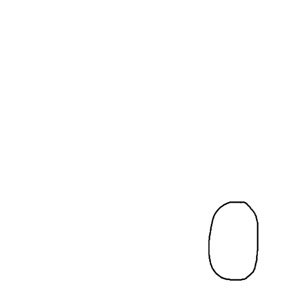 | 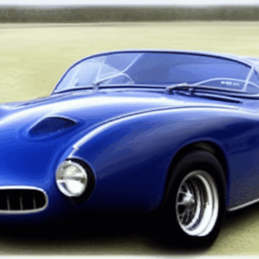 | 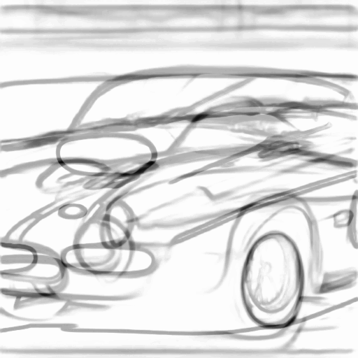 |

**Prompt: "A sports car, cartoon"**

| **Input Sketch** | **Generated Image** | **Suggested Lines**
|:--:| :--: | :--: |
|  | 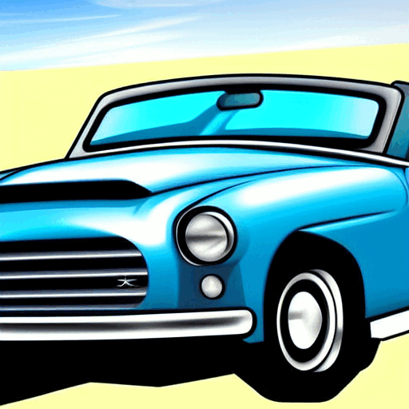 | 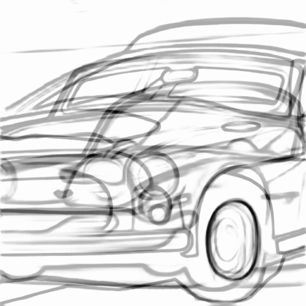 |

**Prompt: "A sports car, cel shaded"**

| **Input Sketch** | **Generated Image** | **Suggested Lines**
|:--:| :--: | :--: |
|  | 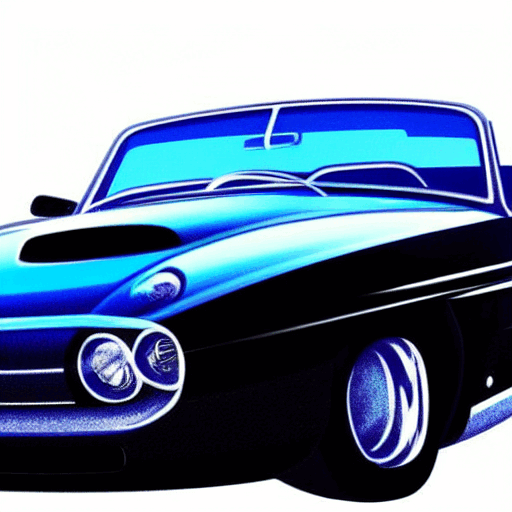 | 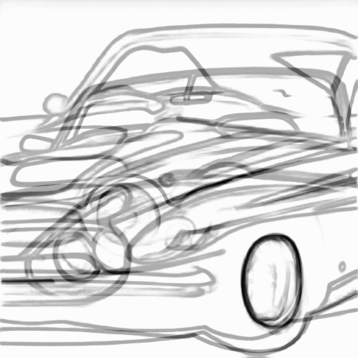 |

**Prompt: "A sports car, rusted"**

| **Input Sketch** | **Generated Image** | **Suggested Lines**
|:--:| :--: | :--: |
|  | 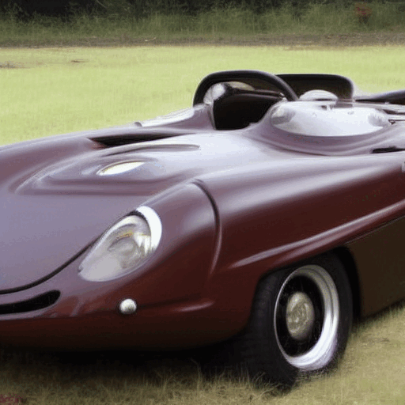 | 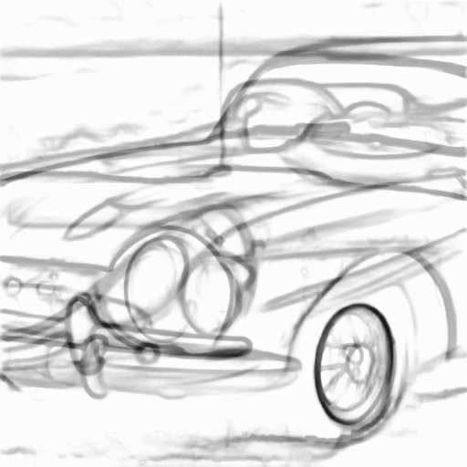 |

## Changing the backbone

We have previously seen that a ControlNet trained on one backbone (ex. Stable Diffusion 1.5) still works on fine-tuned versions of that backbone. This property also holds for our partial-sketch ControlNet model, enabling *Sketch-a-Sketch* to generate suggestions from models fine-tuned for particular domains. For instance, we can use [Ghibli Diffusion](https://huggingface.co/nitrosocke/Ghibli-Diffusion) to generate Ghibli-style characters:

**Prompt: "A young boy"**

| **Input Sketch** | **Generated Image** | **Suggested Lines**
|:--:| :--: | :--: |
| 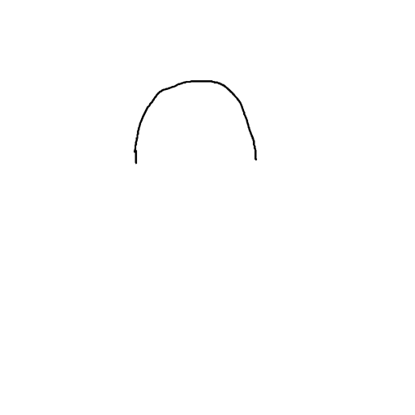 | 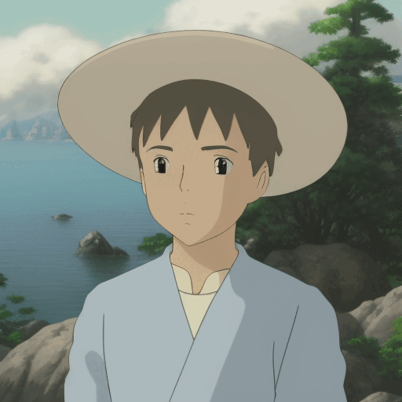 | 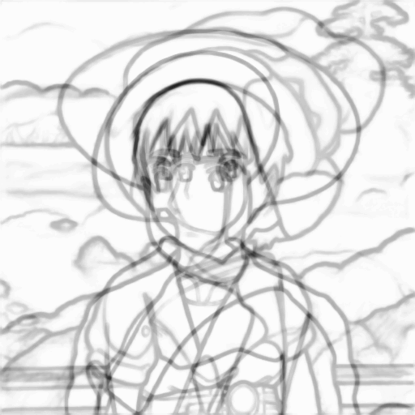 |

## Try it out!

In *Sketch-a-Sketch*, we integrate these capabilities together with the drawing process. At any point in making a sketch, the artist can generate visualizations and stroke modifications, and they can also refine the style of the prompt as they hone in on what they would like to draw.

**[Code](https://github.com/syntaxticsugr/Sketch-a-Sketch) | [Colab Demo](https://colab.research.google.com/drive/1nixppTxf0xkGlZMFdmG1NMbZRrAWuQJz?usp=sharing)**

 

**[Credits](https://github.com/vsanimator/sketch-a-sketch)**

